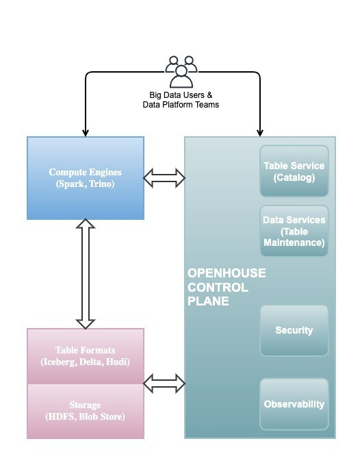

<html>
  <div align="center">
    
  </div>
  <h3 align="center">
    Control Plane for Tables in Open Data Lakehouses
  </h3>
  <div align="center">
    <a href="https://github.com/linkedin/openhouse/actions?query=branch%3Amain">
      
    </a>
    <a href="https://github.com/linkedin/openhouse/commits/main/">
      
    </a>
    <a href="https://www.openhousedb.org/docs/intro/">
      
    </a>
  </div>
  <div align="center">
    <a href="https://linkedin.github.io/openhouse/">
      
    </a>
    <a href="https://join.slack.com/t/openhouse-bap9266/shared_invite/zt-2bsi0t8pi-wUOeDvQr8j8d5yl3X8WQJQ">
      
    </a>
  </div>
</html>

OpenHouse is an open source control plane designed for efficient management of tables within open data lakehouse
deployments. The control plane comprises a **declarative catalog** and a suite of **data services**. Users can
seamlessly define Tables, their schemas, and associated metadata declaratively within the catalog.
OpenHouse reconciles the observed state of Tables with the desired state by orchestrating various
data services.

<html>
  <div align="center">
    
  </div>
</html>

## Getting Started

### Prerequisites

For building and running locally in [Docker Compose](SETUP.md), you would need the following:

- [Java](https://www.oracle.com/java/technologies/downloads/)
  - OpenHouse is currently built with Java 17.
  - Set the `JAVA_HOME` environment variable to the location of your JDK17.
- [Docker](https://www.docker.com/)
- [Docker Compose](https://docs.docker.com/compose/)
- [Python3](https://www.python.org/downloads/)

For deploying OpenHouse to [Kubernetes](DEPLOY.md), you would need the following:
- [Helm](https://helm.sh/docs/intro/install/)
- [Kubernetes](https://kubernetes.io/docs/setup/)

### Building OpenHouse

To build OpenHouse, you can use the following command:
```bash
./gradlew build
```

### Running OpenHouse with Docker Compose

The quickest way to run OpenHouse locally:
```bash
# Build JARs, Docker images, and start containers (default: oh-hadoop-spark recipe)
./gradlew dockerUp

# Or use a lighter recipe for faster startup
./gradlew dockerUp -Precipe=oh-only

# Stop containers
./gradlew dockerDown
```

For detailed configuration options and testing instructions, see the [SETUP](SETUP.md) guide.

### Deploying OpenHouse to Kubernetes

To deploy OpenHouse to Kubernetes, you can use the [DEPLOY](DEPLOY.md) guide. You would build the container images for
all the OpenHouse services, and deploy them to a Kubernetes cluster using Helm.

### Compability Matrix

OpenHouse is built with the following versions of the open-source projects:

| Project | Version |
| --- | --- |
| [Apache Iceberg](https://iceberg.apache.org/releases/#120-release) | 1.2.0 |
| [Apache Spark](https://spark.apache.org/releases/) | 3.1.2 |
| [Apache Livy](https://livy.apache.org/) | 0.7.0-incubating |
| [Apache Hadoop Client](https://hadoop.apache.org/releases.html) | 2.10.0 |
| [Springboot Framework](https://spring.io/projects/spring-boot) | 2.6.6 |
| [OpenAPI](https://swagger.io/specification/) | 3.0.3 |

## Contributing

We welcome contributions to OpenHouse. To get involved:

- Join [OpenHouse Slack](https://join.slack.com/t/openhouse-bap9266/shared_invite/zt-2bsi0t8pi-wUOeDvQr8j8d5yl3X8WQJQ)
- Open [Github Issue](https://github.com/linkedin/openhouse/issues) for the feature or bug you want to collaborate on

Please refer to the [CONTRIBUTING](CONTRIBUTING.md) guide for more details.
To get started on the high-level architecture, please refer to the [ARCHITECTURE](ARCHITECTURE.md) guide.
