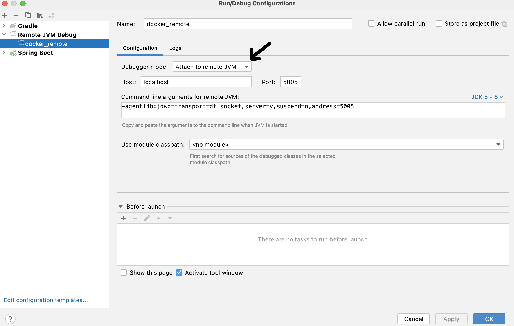

<html>
  <div align="center">
    
  </div>
</html>

Use this guide to setup local development environment for OpenHouse using docker-compose.

## Quick Start (Recommended)

The simplest way to build and run OpenHouse locally:

```bash
# Build everything and start containers (uses oh-hadoop-spark recipe by default)
./gradlew dockerUp

# Or choose a specific recipe
./gradlew dockerUp -Precipe=oh-only           # Lightweight, local filesystem
./gradlew dockerUp -Precipe=oh-hadoop         # With HDFS
./gradlew dockerUp -Precipe=oh-hadoop-spark   # Full stack with Spark (default)

# Stop and remove containers
./gradlew dockerDown -Precipe=oh-only
```

This single command:
1. Builds all required JAR files (service bootJars, Spark runtime uber JARs)
2. Builds Docker images
3. Starts all containers in detached mode

**Requirements:**
- Java 17 (`export JAVA_HOME=$(/usr/libexec/java_home -v 17)` on macOS)
- Docker and Docker Compose

### Available Gradle Docker Tasks

| Task | Description |
|------|-------------|
| `./gradlew dockerPrereqs` | Build only the JAR files required by Docker images |
| `./gradlew dockerBuild -Precipe=<recipe>` | Build JARs and Docker images |
| `./gradlew dockerUp -Precipe=<recipe>` | Build everything and start containers |
| `./gradlew dockerDown -Precipe=<recipe>` | Stop and remove containers |

## Available Recipes

Recipes for setting up OpenHouse in local docker are available [here](infra/recipes/docker-compose)

| Config | Recipe | Notes |
|--------|--------|-------|
| Run OpenHouse Services Only | `oh-only` | Stores data on local filesystem within the application container, with in-memory database. Least resource consuming. |
| Run OpenHouse Services on HDFS | `oh-hadoop` | Stores data on locally running Hadoop HDFS containers, with iceberg-backed database. |
| Run OpenHouse Services on HDFS with Spark | `oh-hadoop-spark` | Stores data on locally running Hadoop HDFS containers, with MySQL database. Spark available for end to end testing. Most resource consuming. Starts Livy server. |

## Manual Docker Compose (Advanced)

If you prefer manual control over the build process:

### Build Containers

Before building docker images, build the openhouse project:
```
./gradlew build
```

Pick a config that suits your testing needs. `cd` into the respective docker-compose directory above. And run the following command to build all the necessary containers:
```
docker compose build [--pull]
```

Sometimes docker compose fails if the dependent base image cannot be pulled with following errors:
```
 => ERROR [oh-hadoop-spark_spark-master internal] load metadata for docker.io/library/openjdk:11.0.11-jdk-slim-buster
```
In such case, you can always explicitly `docker pull` the failing image and re-run the docker compose.

Sometimes dangling images can be created and to avoid running them instead of the latest ones,
you can remove them by running
```
docker rmi $(docker images -f "dangling=true" -q)
```

### Run Containers Manually

Choose a recipe that you want to run. `cd` into the respective docker-compose directory above. And run the following
command to start running all the containers.

Run containers in foreground
```
docker compose up
```

Run containers in background (detached mode)
```
docker compose up -d
```

To bring down the containers,

```
docker compose down
```

> **Note:** The `./gradlew dockerUp` command handles all of this automatically.

## Container Exposed Ports

Following ports can be useful while interacting from host machine with applications running in docker-compose environment.

container|Exposed ports
---|---
/tables|8000
/housetables|8001
/jobs|8002
prometheus|9090
spark-master|9001
livy-server|9003
hdfs-namenode|9870
minio-s3-ui|9871
minio-s3-server|9870
mysql|3306
spark-livy|8998
opa|8181

## Test Services

### Tables REST Service

Setup your terminal to run cURL against REST API. You can also use tools like Postman.

First, lets create headers that we would need for making cURL requests. You would need to replace the
`<COPY_DUMMY_TOKEN_HERE>` part of below command with the JWT token from `dummy.token` file found in the repo.
```
declare -a curlArgs=('-H' 'content-type: application/json' '-H' 'authorization: Bearer <COPY_DUMMY_TOKEN_HERE>')
```
Echoing `curlArgs` should look like below.
```
echo ${curlArgs[@]}
-H content-type: application/json -H authorization: Bearer eyJh...
```

#### Create a Table

Note: clusterId is LocalFSCluster for local docker setup and LocalHadoopCluster for setups that involve HDFS.

```
curl "${curlArgs[@]}" -XPOST http://localhost:8000/v1/databases/d3/tables/ \
--data-raw '{
  "tableId": "t1",
  "databaseId": "d3",
  "baseTableVersion": "INITIAL_VERSION",
  "clusterId": "LocalFSCluster",
  "schema": "{\"type\": \"struct\", \"fields\": [{\"id\": 1,\"required\": true,\"name\": \"id\",\"type\": \"string\"},{\"id\": 2,\"required\": true,\"name\": \"name\",\"type\": \"string\"},{\"id\": 3,\"required\": true,\"name\": \"ts\",\"type\": \"timestamp\"}]}",
  "timePartitioning": {
    "columnName": "ts",
    "granularity": "HOUR"
  },
  "clustering": [
    {
      "columnName": "name"
    }
  ],
  "tableProperties": {
    "key": "value"
  }
}'
```

#### Read a Table

```
curl "${curlArgs[@]}" -XGET http://localhost:8000/v1/databases/d3/tables/t1
```

#### Update a Table

```
curl "${curlArgs[@]}" -XPUT http://localhost:8000/v1/databases/d3/tables/t1 \
--data-raw '{
  "tableId": "t1",
  "databaseId": "d3",
  "baseTableVersion":<fill in previous version>
  "clusterId": "<fill in cluster id>",
  "schema": "{\"type\": \"struct\", \"fields\": [{\"id\": 1,\"required\": true,\"name\": \"id\",\"type\": \"string\"},{\"id\": 2,\"required\": true,\"name\": \"name\",\"type\": \"string\"},{\"id\": 3,\"required\": true,\"name\": \"ts\",\"type\": \"timestamp\"}, {\"id\": 4,\"required\": true,\"name\": \"country\",\"type\": \"string\"}]}",
  "timePartitioning": {
    "columnName": "ts",
    "granularity": "HOUR"
  },
  "clustering": [
    {
      "columnName": "name"
    }
  ],
  "tableProperties": {
    "key": "value"
  }
}'
```

#### List all Tables in a Database

```
curl "${curlArgs[@]}" -XGET http://localhost:8000/v1/databases/d3/tables/
```

#### Delete a Table

```
curl "${curlArgs[@]}" -XDELETE http://localhost:8000/v1/databases/d3/tables/t1
```

### Grant / Revoke

Note: Ensure sharing is enabled for this table.

Example request to create table with sharing Enabled:

```
curl "${curlArgs[@]}" -XPOST http://localhost:8000/v1/databases/d3/tables/ \
--data-raw '{
  "tableId": "t4",
  "databaseId": "d3",
  "baseTableVersion": "INITIAL_VERSION",
  "clusterId": "LocalFSCluster",
  "schema": "{\"type\": \"struct\", \"fields\": [{\"id\": 1,\"required\": true,\"name\": \"id\",\"type\": \"string\"},{\"id\": 2,\"required\": true,\"name\": \"name\",\"type\": \"string\"},{\"id\": 3,\"required\": true,\"name\": \"ts\",\"type\": \"timestamp\"}]}",
  "timePartitioning": {
    "columnName": "ts",
    "granularity": "HOUR"
  },
  "clustering": [
    {
      "columnName": "name"
    }
  ],
  "tableProperties": {
    "key": "value"
  },
  "policies": {
    "sharingEnabled": "true"
  }
}'
```
Update can also be done to enable sharing on an existing table.

REST API call to grant a role to a user on a table.

```
curl "${curlArgs[@]}" -v -X PATCH http://localhost:8000/v1/databases/d3/tables/t1/aclPolicies -d \
'{"role":"TABLE_CREATOR","principal":"urn:li:griduser:DUMMY_AUTHENTICATED_USER","operation":"GRANT"}'
```

### List acl policies

```
curl "${curlArgs[@]}" -XGET http://localhost:8000/v1/databases/d3/aclPolicies/tables/t1/

```

### Test through Spark-shell

Use the recipe in oh-hadoop-spark to start a spark cluster.

Bash onto the `local.spark-master` container:
```
docker exec -it local.spark-master /bin/bash -u <user>

```
By default it picks up `openhouse` user.  
```
docker exec -it local.spark-master /bin/bash
```

Start `spark-shell` with the following command: Available users are `openhouse` and `u_tableowner`.

```
bin/spark-shell --packages org.apache.iceberg:iceberg-spark-runtime-3.1_2.12:1.2.0 \
  --jars openhouse-spark-runtime_2.12-*-all.jar  \
  --conf spark.sql.extensions=org.apache.iceberg.spark.extensions.IcebergSparkSessionExtensions,com.linkedin.openhouse.spark.extensions.OpenhouseSparkSessionExtensions   \
  --conf spark.sql.catalog.openhouse=org.apache.iceberg.spark.SparkCatalog   \
  --conf spark.sql.catalog.openhouse.catalog-impl=com.linkedin.openhouse.spark.OpenHouseCatalog     \
  --conf spark.sql.catalog.openhouse.metrics-reporter-impl=com.linkedin.openhouse.javaclient.OpenHouseMetricsReporter    \
  --conf spark.sql.catalog.openhouse.uri=http://openhouse-tables:8080   \
  --conf spark.sql.catalog.openhouse.auth-token=$(cat /var/config/$(whoami).token) \
  --conf spark.sql.catalog.openhouse.cluster=LocalHadoopCluster
```

If you are integrating with ADLS, use this `spark-shell` command instead:

```
bin/spark-shell --packages org.apache.iceberg:iceberg-azure:1.5.0,org.apache.iceberg:iceberg-spark-runtime-3.1_2.12:1.2.0 \
  --jars openhouse-spark-apps_2.12-*-all.jar,openhouse-spark-runtime_2.12-latest-all.jar  \
  --conf spark.sql.extensions=org.apache.iceberg.spark.extensions.IcebergSparkSessionExtensions,com.linkedin.openhouse.spark.extensions.OpenhouseSparkSessionExtensions   \
  --conf spark.sql.catalog.openhouse=org.apache.iceberg.spark.SparkCatalog   \
  --conf spark.sql.catalog.openhouse.catalog-impl=com.linkedin.openhouse.spark.OpenHouseCatalog     \
  --conf spark.sql.catalog.openhouse.metrics-reporter-impl=com.linkedin.openhouse.javaclient.OpenHouseMetricsReporter    \
  --conf spark.sql.catalog.openhouse.uri=http://openhouse-tables:8080   \
  --conf spark.sql.catalog.openhouse.auth-token=$(cat /var/config/$(whoami).token) \
  --conf spark.sql.catalog.openhouse.cluster=LocalABSCluster \
  --conf spark.sql.catalog.openhouse.io-impl=org.apache.iceberg.azure.adlsv2.ADLSFileIO \
  --conf spark.sql.catalog.openhouse.adls.auth.shared-key.account.name= <account name> \
  --conf spark.sql.catalog.openhouse.adls.auth.shared-key.account.key= <account key>
```

#### Create a table

```
scala> spark.sql("CREATE TABLE openhouse.db.tb (ts timestamp, col1 string, col2 string) PARTITIONED BY (days(ts))").show()
++
||
++
++
```

#### Describe / Insert into / Select from Table

```
scala> spark.sql("DESCRIBE TABLE openhouse.db.tb").show()
+--------------+---------+-------+
|      col_name|data_type|comment|
+--------------+---------+-------+
|            ts|timestamp|       |
|          col1|   string|       |
|          col2|   string|       |
|              |         |       |
|# Partitioning|         |       |
|        Part 0| days(ts)|       |
+--------------+---------+-------+

scala> spark.sql("INSERT INTO TABLE openhouse.db.tb VALUES (current_timestamp(), 'val1', 'val2')")
res4: org.apache.spark.sql.DataFrame = []

scala> spark.sql("INSERT INTO TABLE openhouse.db.tb VALUES (date_sub(CAST(current_timestamp() as DATE), 30), 'val1', 'val2')")
res4: org.apache.spark.sql.DataFrame = []

scala> spark.sql("INSERT INTO TABLE openhouse.db.tb VALUES (date_sub(CAST(current_timestamp() as DATE), 60), 'val1', 'val2')")
res4: org.apache.spark.sql.DataFrame = []


scala> spark.sql("SELECT * FROM openhouse.db.tb").show()
+--------------------+----+----+
|                  ts|col1|col2|
+--------------------+----+----+
|2024-01-25 15:15:...|val1|val2|
|...................|....|....|
+--------------------+----+----+
```

#### List all tables in a database

```
scala> spark.sql("SHOW TABLES IN openhouse.db").show()
+---------+---------+
|namespace|tableName|
+---------+---------+
| db      |      tb|
+---------+---------+
```

#### SET & UNSET table properties
```
scala> spark.sql("ALTER TABLE openhouse.db.tb SET TBLPROPERTIES ('kk'='vv')").show()
scala> spark.sql("SHOW TBLPROPERTIES openhouse.db.tb").show()
+-------------------+--------------------+
|                key|               value|
+-------------------+--------------------+
|current-snapshot-id|                none|
|             format|     iceberg/orc    |
|                 kk|                  vv|
+-------------------+--------------------+


scala> spark.sql("ALTER TABLE openhouse.db.tb UNSET TBLPROPERTIES ('kk')").show();
scala> spark.sql("SHOW TBLPROPERTIES openhouse.db.tb").show()
+-------------------+--------------------+
|                key|               value|
+-------------------+--------------------+
|current-snapshot-id|                none|
|             format|     iceberg/parquet|
+-------------------+--------------------+

```

#### SET POLICY

```
scala> spark.sql("ALTER TABLE openhouse.db.tb SET POLICY ( RETENTION=21d )").show
++
||
++
++

scala> spark.sql("SHOW TBLPROPERTIES openhouse.db.tb (policies)").show(truncate=false)
+--------+---------------------------------------------------------------------------------------------+
|key     |value                                                                                        |
+--------+---------------------------------------------------------------------------------------------+
|policies|{
  "retention": {
    "count": 21,
    "granularity": "DAY"
  },
  "sharingEnabled": false
}|
+--------+---------------------------------------------------------------------------------------------+

scala> spark.sql("SHOW TBLPROPERTIES openhouse.db.tb").filter("key='policies'").select("value").first()
res7: org.apache.spark.sql.Row =
[{
  "retention": {
    "count": 21,
    "granularity": "DAY"
  },
  "sharingEnabled": false
}]
```

#### SET TAG

```
spark.sql("ALTER TABLE openhouse.db.tb MODIFY COLUMN col1 SET TAG = (PII, HC)").show
++
||
++
++

scala> spark.sql("SHOW TBLPROPERTIES openhouse.db.tb").filter("key='policies'").select("value").first()
res1: org.apache.spark.sql.Row =
[{
  "retention": {
    "count": 30,
    "granularity": "DAY"
  },
  "sharingEnabled": false,
  "columnTags": {
    "col1": {
      "tags": [
        "HC",
        "PII"
      ]
    }
  }
}]
```


#### GRANT / REVOKE

Table Sharing is enabled using OPA for local docker setup. By default, sharing is disabled. To enable sharing, run the following command in spark-shell.
This can be done only by the user who created the table. Besides `openhouse` user has global access to manage all tables and can also manage grants on tables.

```
scala> spark.sql("ALTER TABLE openhouse.db.tb SET POLICY (SHARING=true)").show
++
||
++
++

scala> spark.sql("SHOW TBLPROPERTIES openhouse.db.tb").filter("key='policies'").select("value").first()
res1: org.apache.spark.sql.Row =
[{
  "retention": {
    "count": 30,
    "granularity": "DAY"
  },
  "sharingEnabled": true,
  "columnTags": {
    "col1": {
      "tags": [
        "HC",
        "PII"
      ]
    }
  }
}]

```

As user `u_tableowner` , exec into spark container, login to spark-shell and try to access the table. 403 is expected since user does not have read access.

```
scala> spark.sql("select * from openhouse.db.tb").show()
com.linkedin.openhouse.javaclient.exception.WebClientResponseWithMessageException: 403 Forbidden , {"status":"FORBIDDEN","error":"Forbidden","message":"Operation on table db.tb failed as user u_tableowner is unauthorized","stacktrace":null,"cause":"Not Available"}

```

Now `openhouse` user can to grant read access to user `u_tableowner` on the table.

```
scala> spark.sql("GRANT SELECT ON TABLE openhouse.db.tb TO u_tableowner").show
++
||
++
++

scala> spark.sql("SHOW GRANTS ON TABLE openhouse.db.tb").show
+---------+--------------+
|privilege|principal     |
+---------+--------------+
|   SELECT| u_tableowner |
+---------+--------------+
```

Now user `u_tableowner` can repeat the earlier steps and can access the table.

```
scala> spark.sparkContext.sparkUser
res8: String = u_tableowner

scala> spark.sql("select * from openhouse.db.tb").show()
+--------------------+----+----+
|                  ts|col1|col2|
+--------------------+----+----+
|2024-02-24 22:42:...|val1|val2|
+--------------------+----+----+

```

Some more examples of GRANT / REVOKE commands that are supported.

``` 

scala> spark.sql("REVOKE SELECT ON TABLE openhouse.db.tb FROM u_tableowner").show
++
||
++
++

scala> spark.sql("GRANT CREATE TABLE ON DATABASE openhouse.db TO user").show
++
||
++
++

scala> spark.sql("REVOKE CREATE TABLE ON DATABASE openhouse.db FROM user").show
++
||
++
++

scala> spark.sql("GRANT MANAGE GRANTS ON TABLE openhouse.db.tb TO user").show
++
||
++
++

scala> spark.sql("REVOKE MANAGE GRANTS ON TABLE openhouse.db.tb FROM user").show
++
||
++
++


scala> spark.sql("GRANT SELECT ON DATABASE openhouse.db TO dbReader").show
++
||
++
++

scala> spark.sql("SHOW GRANTS ON DATABASE openhouse.db.tb").show
+---------+---------+
|privilege|principal|
+---------+---------+
|   SELECT|  dbReader|
+---------+---------+

```

### Test through Livy

Use the recipe in oh-hadoop-spark to start a spark cluster. In the root folder for the project you will find a script
called `scripts/python/livy_cli.py`.

Check that Livy server works by running:
`scripts/python/livy_cli.py -t livy_server`

Run SQL REPL:
`scripts/python/livy_cli.py -t sql_repl`

### Test through job-scheduler

To run the OpenHouse data services, you can leverage job scheduler to run the jobs for a given job types across all
tables.

Job scheduler iterates through all the tables and triggers the requested job based on the config defined in catalog.
For the table created in [here](#test-through-spark-shell) we can see the effect of running job-scheduler for retention
job by running the following commands.

Build images with jobs scheduler, and run the scheduler separately after all other services start.
```
docker compose --profile with_jobs_scheduler build
docker compose --profile with_jobs_scheduler run openhouse-jobs-scheduler - \
    --type RETENTION --cluster local --tablesURL http://openhouse-tables:8080 --jobsURL http://openhouse-jobs:8080 -\
    --tableMinAgeThresholdHours 0 --taskPollIntervalMs 5000
```

> [!NOTE]
> Check the number of rows before and after job scheduler run for retention job type.

> [!NOTE]
> Try HTTP plugin in IntelliJ to trigger /jobs service local endpoint in local mode by running HTTP scripts in
services/jobs/src/test/http/.

## FAQs

### Q. My docker setup fails to create LLB definition.

Here is the error I see,
```bash
failed to solve with frontend dockerfile.v0: failed to create LLB definition: unexpected status code [manifests 0.0.1]: 401 Unauthorized
```

Running following commands should fix the issue.
```bash
export DOCKER_BUILDKIT=0
export COMPOSE_DOCKER_CLI_BUILD=0
```
These variables disable buildkit and disabled usage of native Docker's CLI `build` command when building images.
See this [link](https://github.com/docker/buildx/issues/426#issuecomment-723208580) for details.

### Q. How to browse files generated in HDFS?

If you are testing OH services with Hadoop HDFS containers.
```
# Enter the running HDFS namenode container
docker exec -it local.namenode bash

# Run HDFS dfs to list files
root@aa91a7bc8575:/# hdfs dfs -ls -R /data/openhouse/
```

### Q. HDFS container is entering safe mode. How do I leave the safemode?

After running these commands HDFS leaves safe mode and normal IO operations can be resumed.
```
# Enter the running HDFS namenode container
docker exec -it local.namenode bash

# Run HDFS dfsadmin command to leave safemode
root@aa91a7bc8575:/# hdfs dfsadmin -safemode leave
```

### Q. Which directory should I run docker compose commands from?

Pick your recipe and `cd` into the directory that contains docker-compose.yml  See `Build Containers` for options
```
cd infra/recipes/docker-compose/{recipe-directory}
```

### Q. How do I monitor metrics emitted by my service?

We run prometheus that scrapes metrics emitted by services configured to do so. These metrics can be explored in
prometheus UI by hitting below URL in browser.
```
http://localhost:9090/
```

If you want to observe a direct feed of metrics your service is emitting, you can hit the following URL from browser or
CLI.
```
// 8000 -> is the service port of /tables service.
http://localhost:8000/actuator/prometheus
```

### Q: How do I setup remote debugger using IntelliJ for services running in Docker?
We will use the setup for `tables` service as an example in the steps below. You could do the similar for any other services of interest.
We deploy the remote debugger for one service at a time due to the limitation posed by IDE for now.

Step 1: Choose the recipe that fits your requirement, and navigate into the corresponding folder. For example:
`cd oh-only`

Step 2: Running `docker compose -f docker-compose.yml -f ../common/debug-profile/tables.yml up` and check the target service is up and running.
The `tables.yml` adds the required configuration and merge with base `docker-compose` file.

Step 3: Start remote debugger process on intelliJ with "Attached to remote JVM option".


Step 4: Set the breakpoint in the line of interests.

Step 5: Start a request against the service port exposed, in the case of `tables` that is `8000`. You should expect the execution paused in the breakpoint now.

### Q: How do I login to the MySQL CLI to inspect table schemas/rows created by HTS?
If MySQL container is booted up as part of your executing recipe, here's what you can do to inspect data in mysql:

Environment|Value
---|---
MYSQL_ROOT_PASSWORD|oh_root_password
MYSQL_USER|oh_user
MYSQL_PASSWORD|oh_password
MYSQL_DATABASE|oh_db

After all the containers in the recipe are up, login to the mysql container:
```
docker exec -it 'local.mysql' /bin/sh
```
Start MySql CLI with `oh_user` user+password and `oh_db` database:
```
mysql -uoh_user -poh_password oh_db
```
Now you can run commands like:
```mysql
mysql> show tables;
+-----------------+
| Tables_in_oh_db |
+-----------------+
| job_row         |
| user_table_row  |
+-----------------+
```

### Q: Housetables service fails to start with error `Communications link failure`, as below:
```
local.openhouse-housetables  | org.springframework.beans.factory.BeanCreationException: Error creating bean with name 'dataSourceScriptDatabaseInitializer' defined in class path resource [org/springframework/boot/autoconfigure/sql/init/DataSourceInitializationConfiguration.class]: Invocation of init method failed; nested exception is org.springframework.jdbc.datasource.init.UncategorizedScriptException: Failed to execute database script; nested exception is org.springframework.jdbc.CannotGetJdbcConnectionException: Failed to obtain JDBC Connection; nested exception is com.mysql.cj.jdbc.exceptions.CommunicationsException: Communications link failure
```

This is due to `local.mysql` container did not initialize before `local.openhouse-housetables` container. A quick fix is
to restart the `local.openhouse-housetables` container using `docker compose up`.
