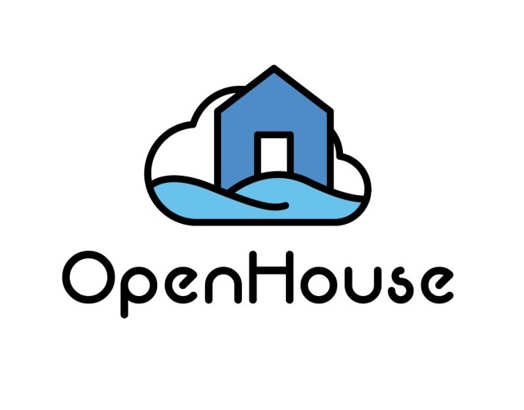
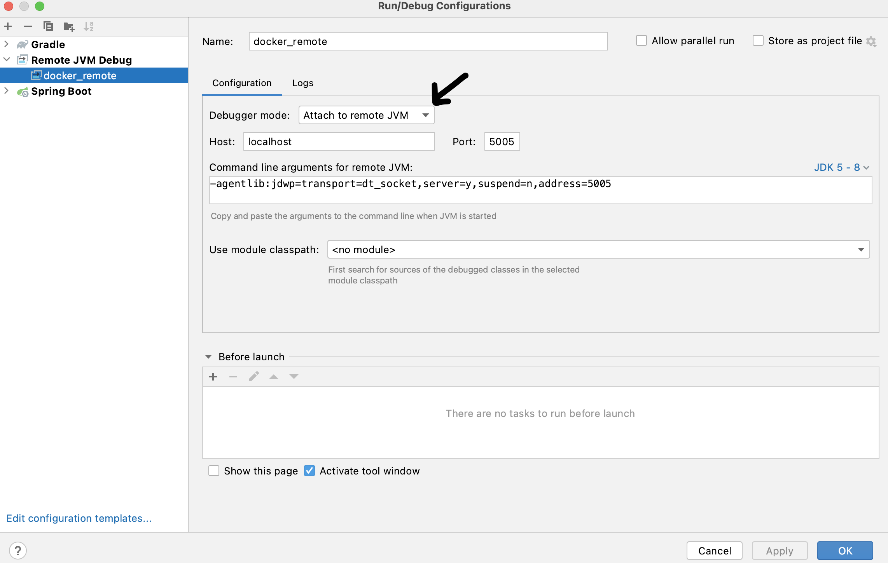

<html>
  <div align="center">
    
  </div>
</html>

Use this guide to setup local development environment for OpenHouse using docker-compose.

## Quick Start (Recommended)

The simplest way to build and run OpenHouse locally:

```bash
# Build everything and start containers (uses oh-hadoop-spark recipe by default)
./gradlew dockerUp

# Or choose a specific recipe
./gradlew dockerUp -Precipe=oh-only           # Lightweight, local filesystem
./gradlew dockerUp -Precipe=oh-hadoop         # With HDFS
./gradlew dockerUp -Precipe=oh-hadoop-spark   # Full stack with Spark (default)

# Stop and remove containers
./gradlew dockerDown -Precipe=oh-only
```

This single command:
1. Builds all required JAR files (service bootJars, Spark runtime uber JARs)
2. Builds Docker images
3. Starts all containers in detached mode

**Requirements:**
- Java 17 (`export JAVA_HOME=$(/usr/libexec/java_home -v 17)` on macOS)
- Docker and Docker Compose

### Available Gradle Docker Tasks

| Task | Description |
|------|-------------|
| `./gradlew dockerPrereqs` | Build only the JAR files required by Docker images |
| `./gradlew dockerBuild -Precipe=<recipe>` | Build JARs and Docker images |
| `./gradlew dockerUp -Precipe=<recipe>` | Build everything and start containers |
| `./gradlew dockerDown -Precipe=<recipe>` | Stop and remove containers |

## HTS index regression tests (no load generator)

The HTS index tests live in
`services/housetables/src/test/java/com/linkedin/openhouse/housetables/index`.
They test the **current checkout**, not the historical service image used by the Python load
reproduction. No staging access, service Docker image, Spark, or HTTP listener is needed.

```bash
# Java 17; fast unit contracts, controller dispatch, and plan-detector tests (no Docker).
./gradlew :services:housetables:test --tests 'com.linkedin.openhouse.housetables.index.*'

# Docker required. Real controllers/services/repositories in-process via MockMvc + MySQL.
./gradlew :services:housetables:mysqlIndexTest
```

For a Git worktree, add `-x CopyGitHooksTask`: the existing hook-copy task assumes `.git`
is a directory. This excludes only hook installation, not tests. MySQL tests are tagged
`mysql-index` and run **only** through `mysqlIndexTest`; ordinary unit runs do not start Docker.
CI runners that require the database index contract should run both commands.
The image defaults to `mysql:8.4.11`; use `-PmysqlIndexImage=mysql:<version>` to check another
supported MySQL 8 version.

The isolated, disposable MySQL container has a 1 CPU / 512 MiB limit and 128 MiB InnoDB
buffer pool. It executes the **byte-identical source-of-truth DDL**, in order:
`0000__baseline.sql` then `0001__add_entity_type_to_user_table_row.sql`. The files are
copied from `services/housetables/ddl/` at commit
`970c87aaae748edb2bcafdb5d4f3e47495e91ac5` on
`ruolin59:rufan-linkedin-combine-entitytype-and-index-fix`, into
`services/housetables/src/test/resources/mysql-production/`. Their SHA-256 hashes are
verified before execution and recorded in `fixture.json`. Both A/B revisions use this
same schema, including the entity-type migration; the tested service code is the variable.
Neither `schema.sql` nor H2 `data.sql` is executed, and **no test-specific indexes are added**.
There are 10,000 rows in **each** of the four HTS tables.

- `user_table_row`: primary key `(database_id, table_id)` plus **non-unique**
  `idx_user_table_upper_db_table`
  `(UPPER(database_id), UPPER(table_id), version, storage_type, creation_time)`.
- `soft_deleted_user_table_row`: unchanged schema primary key
  `(database_id, table_id, deleted_at_ms)`, with **no functional or secondary index**.
- Jobs use the schema's `job_id` primary key; toggle rules use its unique
  `(feature, database_pattern, table_pattern)` index.

The source DDL confirms the live and soft-deleted definitions against production
`SHOW CREATE TABLE`; its header still marks jobs/toggles as unverified approximations.
The exact column widths, nullability, extra columns, index order/uniqueness, engine and
collation are preserved. DDL runs only in the disposable container, never against a deployment.
Distribution is 100 databases with 100 live rows each; soft-deleted keys have 10 versions;
features each have 100 rules.

Every mapped HTS controller route must appear in the shared scenario inventory; the unit
test fails when an endpoint is added without an explicit policy. Unit tests also verify
controller key/parameter forwarding with mocked handlers, derived case-insensitive key
predicates, explicit JPQL key-function compatibility, and job-key lookup dispatch.
They cannot establish optimizer behavior; the MySQL suite supplies that evidence.

| Endpoint | Selective access contract / tested variants |
|---|---|
| `GET /hts/tables` | Mixed-case composite-key lookup |
| `GET /hts/tables/query` | Database, exact table, prefix and leading-wildcard patterns; database enumeration exempt |
| `GET /v1/hts/tables/query` | Same variants, including forced count queries |
| `GET /hts/tables/querySoftDeleted` | Database with/without table and expiry filter; page and count |
| `PUT /hts/tables` | Create/update lookups plus actual update |
| `DELETE /hts/tables` | Lookup, derived-delete lookup and physical delete |
| `DELETE /v1/hts/tables` | Hard and soft-delete branches, including write-side lookups |
| `PATCH /hts/tables/rename` | Existence check and actual rename UPDATE |
| `PUT /hts/tables/restore` | Live-key conflict lookup, deleted-version lookup/delete and restore |
| `DELETE /hts/tables/purge` | Both all-versions and expiry-bounded deletes |
| `GET /hts/jobs` | Primary-key lookup |
| `PUT /hts/jobs` | Create/update existence/merge lookups and actual update |
| `DELETE /hts/jobs` | Existence, lookup and actual delete |
| `GET /hts/jobs/query` | Job-ID filter must be selective; full/state-only listing exempt (no state index) |
| `GET /hts/togglestatuses` | Feature-prefix index lookup before wildcard rules are evaluated in memory |
| `GET /hts/entities` | Neutral point lookup for table and view rows |
| `GET /hts/views` | View-scoped point lookup |
| `GET /v1/hts/views/query` | Database/exact/prefix/leading-wildcard queries and counts; unbounded listing exempt |
| `PUT /hts/views` | Create/update lookups and actual update |
| `DELETE /hts/views` | View-scoped lookup and delete |

The five entity/view routes exist in both A/B revisions, but not reverted main. Their scenarios
are enabled when that controller API is present; the inventory guard still requires exact
coverage of every discovered route. View scenarios mark the selected database's 100 rows
as views inside the rolled-back test transaction. All other rows retain legacy NULL type.

Full database/job listings are intentionally not required to be selective. A leading wildcard
on a table name is **not** exempt when a database key still supplies a selective left prefix.
Unsupported general table filters are rejected by API validation and do not create additional
successful API query modes; the unit JPQL guards also cover those repository methods directly.

The JDBC capture explains every actual bound SELECT/UPDATE/DELETE **before execution, on the
same connection**, preserving null/type bindings and the original SQL. It does not run
`EXPLAIN ANALYZE` on mutations or rewrite endpoint predicates. Folded COUNT plans additionally
get a plain-projection access probe with the identical predicate/bindings. INSERT has no
row-selection plan; its preflight lookups are checked. Each scenario runs in a rolled-back
transaction and forces flush, so tests are independent and cannot hide writes in an ORM cache.

The detector rejects both `ALL` (table scan) and `index` (full index scan), missing evidence,
and unbounded ranges. It accepts selective `const`/`eq_ref`/`ref`/`range` with a chosen index
and a bounded **estimated** row count: 10 for point lookups, 30 for a deleted table's versions,
300 for a database/feature subset. These budgets allow optimizer estimate variation, not
latency variation. Explicit constant-index misses are accepted for create/conflict checks.
Controls demonstrate that the detector accepts UPPER with the functional index and rejects
LOWER and an ignored functional index for the live table. Separate soft-delete SELECT and
DELETE plan controls accept bare key predicates using `PRIMARY` and reject **both LOWER and
UPPER** on key columns. The fixture's case-insensitive collation supports mixed-case lookups
without wrapping those columns. The soft-delete unit guard likewise rejects both functions;
changing LOWER to UPPER is not a fix for a plain primary key.

**Active tests are strict regression tests, not expected-failure demos.** The six soft-delete
query unit cases and seven soft-delete endpoint scenarios are temporarily disabled pending
a primary-key access-pattern fix. The job-ID dispatch unit test and ID-filtered endpoint
scenario are also disabled pending indexed candidate retrieval. These are isolated in
`@Disabled` methods with TODO comments; the original assertions and complete endpoint
inventory are retained. Parameterized methods disabled at the method level are not expanded
into individual invocations by JUnit, so their case counts do not appear as individual skips.
Controller-routing tests, detector controls (including plain soft-delete key controls),
other job operations, and all live-table/view index checks remain active.
Production code is unchanged. Re-enable the deferred methods when their access patterns
are fixed. A green active test requires real endpoint SQL to meet the policy.

### Production-DDL A/B verification

Before the targeted test deferrals, the same test sources and DDL were run first on broken commit
`efa659bdb0031f951e1af03ddcfde35acc2dff80`, then on combined-fix commit
`970c87aaae748edb2bcafdb5d4f3e47495e91ac5`, with fresh MySQL 8.4.11 containers.
This is in-process endpoint integration via MockMvc, not a deployed-service/network load test.

| Suite | Broken | Combined fix |
|---|---|---|
| Unit tests | 63 pass / 21 fail | 77 pass / 7 fail |
| MySQL endpoint cases and controls | 18 pass / 27 fail | 37 pass / 8 fail |

All 43 standalone controller-binding cases pass on both. The combined fix resolves all 19
failing live-table/view MySQL scenarios and 14 live-table query unit guards. For example,
table/view point reads change from `ALL` (~10,000 estimated rows) to `ref` on
`idx_user_table_upper_db_table` (1 row); database pages and counts use `ref` (100 rows),
and rename uses `range` (1 row).

**The full, un-deferred combined branch did not pass the broader suite.** Six soft-delete JPQL guards
and the job-ID dispatch guard remain red. Eight endpoint cases still scan: four soft-delete
query combinations, restore, both purge modes, and job-ID search. Their production query
implementations are unchanged between the two revisions. These remaining defects are separate
from the now-verified live-table fix and are now explicitly deferred as described above,
not treated as valid indexed behavior.

After those deferrals, validation on the same combined-fix commit passes all **77 active unit
cases** and **37 active MySQL cases/controls**. The older broken commit and reverted main
still contain live-table access defects; those checks have not been disabled.

Detailed SQL, bindings, plans, fixture DDL, and version are saved under
`build/housetables/reports/mysql-index-plans/`. JUnit reports are under
`build/housetables/reports/tests/{test,mysqlIndexTest}/`. No latency or throughput assertions
are used, and absence of Docker/MySQL is a failure rather than a silently skipped integration run.

## Available Recipes

Recipes for setting up OpenHouse in local docker are available [here](infra/recipes/docker-compose)

| Config | Recipe | Notes |
|--------|--------|-------|
| Run OpenHouse Services Only | `oh-only` | Stores data on local filesystem within the application container, with in-memory database. Least resource consuming. |
| Run OpenHouse Services Only, on MySQL | `oh-only-mysql` | As `oh-only`, but House Tables runs against a MySQL container bootstrapped from `services/housetables/ddl`. Use when House Tables persistence behaviour matters. Used by CI. |
| Run OpenHouse Services on HDFS | `oh-hadoop` | Stores data on locally running Hadoop HDFS containers, with iceberg-backed database. |
| Run OpenHouse Services on HDFS with Spark | `oh-hadoop-spark` | Stores data on locally running Hadoop HDFS containers, with MySQL database. Spark available for end to end testing. Most resource consuming. Starts Livy server. |

## Manual Docker Compose (Advanced)

If you prefer manual control over the build process:

### Build Containers

Before building docker images, build the openhouse project:
```
./gradlew build
```

Pick a config that suits your testing needs. `cd` into the respective docker-compose directory above. And run the following command to build all the necessary containers:
```
docker compose build [--pull]
```

Sometimes docker compose fails if the dependent base image cannot be pulled with following errors:
```
 => ERROR [oh-hadoop-spark_spark-master internal] load metadata for docker.io/library/openjdk:11.0.11-jdk-slim-buster
```
In such case, you can always explicitly `docker pull` the failing image and re-run the docker compose.

Sometimes dangling images can be created and to avoid running them instead of the latest ones,
you can remove them by running
```
docker rmi $(docker images -f "dangling=true" -q)
```

### Run Containers Manually

Choose a recipe that you want to run. `cd` into the respective docker-compose directory above. And run the following
command to start running all the containers.

Run containers in foreground
```
docker compose up
```

Run containers in background (detached mode)
```
docker compose up -d
```

To bring down the containers,

```
docker compose down
```

> **Note:** The `./gradlew dockerUp` command handles all of this automatically.

## Container Exposed Ports

Following ports can be useful while interacting from host machine with applications running in docker-compose environment.

container|Exposed ports
---|---
/tables|8000
/housetables|8001
/jobs|8002
prometheus|9090
spark-master|9001
livy-server|9003
hdfs-namenode|9870
minio-s3-ui|9871
minio-s3-server|9870
mysql|3306
spark-livy|8998
opa|8181

## Test Services

### Tables REST Service

Setup your terminal to run cURL against REST API. You can also use tools like Postman.

First, lets create headers that we would need for making cURL requests. You would need to replace the
`<COPY_DUMMY_TOKEN_HERE>` part of below command with the JWT token from `dummy.token` file found in the repo.
```
declare -a curlArgs=('-H' 'content-type: application/json' '-H' 'authorization: Bearer <COPY_DUMMY_TOKEN_HERE>')
```
Echoing `curlArgs` should look like below.
```
echo ${curlArgs[@]}
-H content-type: application/json -H authorization: Bearer eyJh...
```

#### Create a Table

Note: clusterId is LocalFSCluster for local docker setup and LocalHadoopCluster for setups that involve HDFS.

```
curl "${curlArgs[@]}" -XPOST http://localhost:8000/v1/databases/d3/tables/ \
--data-raw '{
  "tableId": "t1",
  "databaseId": "d3",
  "baseTableVersion": "INITIAL_VERSION",
  "clusterId": "LocalFSCluster",
  "schema": "{\"type\": \"struct\", \"fields\": [{\"id\": 1,\"required\": true,\"name\": \"id\",\"type\": \"string\"},{\"id\": 2,\"required\": true,\"name\": \"name\",\"type\": \"string\"},{\"id\": 3,\"required\": true,\"name\": \"ts\",\"type\": \"timestamp\"}]}",
  "timePartitioning": {
    "columnName": "ts",
    "granularity": "HOUR"
  },
  "clustering": [
    {
      "columnName": "name"
    }
  ],
  "tableProperties": {
    "key": "value"
  }
}'
```

#### Read a Table

```
curl "${curlArgs[@]}" -XGET http://localhost:8000/v1/databases/d3/tables/t1
```

#### Update a Table

The PUT request requires two values from a prior GET response:

- **`baseTableVersion`** — use the `tableVersion` field from GET (after the first update this becomes a metadata file path, not `"INITIAL_VERSION"`)
- **`tableProperties`** — must include all `openhouse.*` properties from the GET response merged with any user-defined properties; omitting them causes a 500 in the server's cross-cluster eligibility check

First GET the current state:

```
curl "${curlArgs[@]}" -XGET http://localhost:8000/v1/databases/d3/tables/t1
```

Then PUT with the returned `tableVersion` and `tableProperties`:

```
curl "${curlArgs[@]}" -XPUT http://localhost:8000/v1/databases/d3/tables/t1 \
--data-raw '{
  "tableId": "t1",
  "databaseId": "d3",
  "clusterId": "<clusterId from GET response>",
  "tableType": "PRIMARY_TABLE",
  "baseTableVersion": "<tableVersion from GET response>",
  "schema": "{\"type\": \"struct\", \"fields\": [{\"id\": 1,\"required\": true,\"name\": \"id\",\"type\": \"string\"},{\"id\": 2,\"required\": true,\"name\": \"name\",\"type\": \"string\"},{\"id\": 3,\"required\": true,\"name\": \"ts\",\"type\": \"timestamp\"}, {\"id\": 4,\"required\": true,\"name\": \"country\",\"type\": \"string\"}]}",
  "timePartitioning": {
    "columnName": "ts",
    "granularity": "HOUR"
  },
  "clustering": [
    {
      "columnName": "name"
    }
  ],
  "tableProperties": {
    "<copy all key/value pairs from tableProperties in GET response, including openhouse.* keys>": "...",
    "key": "value"
  }
}'
```

#### List all Tables in a Database

```
curl "${curlArgs[@]}" -XGET http://localhost:8000/v1/databases/d3/tables/
```

#### Delete a Table

```
curl "${curlArgs[@]}" -XDELETE http://localhost:8000/v1/databases/d3/tables/t1
```

### Grant / Revoke

Note: Ensure sharing is enabled for this table.

Example request to create table with sharing Enabled:

```
curl "${curlArgs[@]}" -XPOST http://localhost:8000/v1/databases/d3/tables/ \
--data-raw '{
  "tableId": "t4",
  "databaseId": "d3",
  "baseTableVersion": "INITIAL_VERSION",
  "clusterId": "LocalFSCluster",
  "schema": "{\"type\": \"struct\", \"fields\": [{\"id\": 1,\"required\": true,\"name\": \"id\",\"type\": \"string\"},{\"id\": 2,\"required\": true,\"name\": \"name\",\"type\": \"string\"},{\"id\": 3,\"required\": true,\"name\": \"ts\",\"type\": \"timestamp\"}]}",
  "timePartitioning": {
    "columnName": "ts",
    "granularity": "HOUR"
  },
  "clustering": [
    {
      "columnName": "name"
    }
  ],
  "tableProperties": {
    "key": "value"
  },
  "policies": {
    "sharingEnabled": "true"
  }
}'
```
Update can also be done to enable sharing on an existing table.

REST API call to grant a role to a user on a table.

```
curl "${curlArgs[@]}" -v -X PATCH http://localhost:8000/v1/databases/d3/tables/t1/aclPolicies -d \
'{"role":"TABLE_CREATOR","principal":"urn:li:griduser:DUMMY_AUTHENTICATED_USER","operation":"GRANT"}'
```

### List acl policies

```
curl "${curlArgs[@]}" -XGET http://localhost:8000/v1/databases/d3/aclPolicies/tables/t1/

```

### Test through Spark-shell

Use the recipe in oh-hadoop-spark to start a spark cluster.

Bash onto the `local.spark-master` container:
```
docker exec -it local.spark-master /bin/bash -u <user>

```
By default it picks up `openhouse` user.  
```
docker exec -it local.spark-master /bin/bash
```

Start `spark-shell` with the following command: Available users are `openhouse` and `u_tableowner`.

```
bin/spark-shell --master spark://spark-master:7077 \
  --packages org.apache.iceberg:iceberg-spark-runtime-3.1_2.12:1.2.0 \
  --jars openhouse-spark-runtime_2.12-*-all.jar  \
  --conf spark.sql.extensions=org.apache.iceberg.spark.extensions.IcebergSparkSessionExtensions,com.linkedin.openhouse.spark.extensions.OpenhouseSparkSessionExtensions   \
  --conf spark.sql.catalog.openhouse=org.apache.iceberg.spark.SparkCatalog   \
  --conf spark.sql.catalog.openhouse.catalog-impl=com.linkedin.openhouse.spark.OpenHouseCatalog     \
  --conf spark.sql.catalog.openhouse.metrics-reporter-impl=com.linkedin.openhouse.javaclient.OpenHouseMetricsReporter    \
  --conf spark.sql.catalog.openhouse.uri=http://openhouse-tables:8080   \
  --conf spark.sql.catalog.openhouse.auth-token=$(cat /var/config/$(whoami).token) \
  --conf spark.sql.catalog.openhouse.cluster=LocalHadoopCluster
```

> **Note:** `--master spark://spark-master:7077` connects to the Spark standalone cluster
> instead of using the default `local[*]` mode. Without this, Spark actions that scan
> HDFS (e.g. orphan file deletion) may hang.

If you are integrating with ADLS, use this `spark-shell` command instead:

```
bin/spark-shell --packages org.apache.iceberg:iceberg-azure:1.5.0,org.apache.iceberg:iceberg-spark-runtime-3.1_2.12:1.2.0 \
  --jars openhouse-spark-apps_2.12-*-all.jar,openhouse-spark-runtime_2.12-latest-all.jar  \
  --conf spark.sql.extensions=org.apache.iceberg.spark.extensions.IcebergSparkSessionExtensions,com.linkedin.openhouse.spark.extensions.OpenhouseSparkSessionExtensions   \
  --conf spark.sql.catalog.openhouse=org.apache.iceberg.spark.SparkCatalog   \
  --conf spark.sql.catalog.openhouse.catalog-impl=com.linkedin.openhouse.spark.OpenHouseCatalog     \
  --conf spark.sql.catalog.openhouse.metrics-reporter-impl=com.linkedin.openhouse.javaclient.OpenHouseMetricsReporter    \
  --conf spark.sql.catalog.openhouse.uri=http://openhouse-tables:8080   \
  --conf spark.sql.catalog.openhouse.auth-token=$(cat /var/config/$(whoami).token) \
  --conf spark.sql.catalog.openhouse.cluster=LocalABSCluster \
  --conf spark.sql.catalog.openhouse.io-impl=org.apache.iceberg.azure.adlsv2.ADLSFileIO \
  --conf spark.sql.catalog.openhouse.adls.auth.shared-key.account.name= <account name> \
  --conf spark.sql.catalog.openhouse.adls.auth.shared-key.account.key= <account key>
```

#### Create a table

```
scala> spark.sql("CREATE TABLE openhouse.db.tb (ts timestamp, col1 string, col2 string) PARTITIONED BY (days(ts))").show()
++
||
++
++
```

#### Describe / Insert into / Select from Table

```
scala> spark.sql("DESCRIBE TABLE openhouse.db.tb").show()
+--------------+---------+-------+
|      col_name|data_type|comment|
+--------------+---------+-------+
|            ts|timestamp|       |
|          col1|   string|       |
|          col2|   string|       |
|              |         |       |
|# Partitioning|         |       |
|        Part 0| days(ts)|       |
+--------------+---------+-------+

scala> spark.sql("INSERT INTO TABLE openhouse.db.tb VALUES (current_timestamp(), 'val1', 'val2')")
res4: org.apache.spark.sql.DataFrame = []

scala> spark.sql("INSERT INTO TABLE openhouse.db.tb VALUES (date_sub(CAST(current_timestamp() as DATE), 30), 'val1', 'val2')")
res4: org.apache.spark.sql.DataFrame = []

scala> spark.sql("INSERT INTO TABLE openhouse.db.tb VALUES (date_sub(CAST(current_timestamp() as DATE), 60), 'val1', 'val2')")
res4: org.apache.spark.sql.DataFrame = []


scala> spark.sql("SELECT * FROM openhouse.db.tb").show()
+--------------------+----+----+
|                  ts|col1|col2|
+--------------------+----+----+
|2024-01-25 15:15:...|val1|val2|
|...................|....|....|
+--------------------+----+----+
```

#### List all tables in a database

```
scala> spark.sql("SHOW TABLES IN openhouse.db").show()
+---------+---------+
|namespace|tableName|
+---------+---------+
| db      |      tb|
+---------+---------+
```

#### SET & UNSET table properties
```
scala> spark.sql("ALTER TABLE openhouse.db.tb SET TBLPROPERTIES ('kk'='vv')").show()
scala> spark.sql("SHOW TBLPROPERTIES openhouse.db.tb").show()
+-------------------+--------------------+
|                key|               value|
+-------------------+--------------------+
|current-snapshot-id|                none|
|             format|     iceberg/orc    |
|                 kk|                  vv|
+-------------------+--------------------+


scala> spark.sql("ALTER TABLE openhouse.db.tb UNSET TBLPROPERTIES ('kk')").show();
scala> spark.sql("SHOW TBLPROPERTIES openhouse.db.tb").show()
+-------------------+--------------------+
|                key|               value|
+-------------------+--------------------+
|current-snapshot-id|                none|
|             format|     iceberg/parquet|
+-------------------+--------------------+

```

#### SET POLICY

```
scala> spark.sql("ALTER TABLE openhouse.db.tb SET POLICY ( RETENTION=21d )").show
++
||
++
++

scala> spark.sql("SHOW TBLPROPERTIES openhouse.db.tb (policies)").show(truncate=false)
+--------+---------------------------------------------------------------------------------------------+
|key     |value                                                                                        |
+--------+---------------------------------------------------------------------------------------------+
|policies|{
  "retention": {
    "count": 21,
    "granularity": "DAY"
  },
  "sharingEnabled": false
}|
+--------+---------------------------------------------------------------------------------------------+

scala> spark.sql("SHOW TBLPROPERTIES openhouse.db.tb").filter("key='policies'").select("value").first()
res7: org.apache.spark.sql.Row =
[{
  "retention": {
    "count": 21,
    "granularity": "DAY"
  },
  "sharingEnabled": false
}]
```

#### SET TAG

```
spark.sql("ALTER TABLE openhouse.db.tb MODIFY COLUMN col1 SET TAG = (PII, HC)").show
++
||
++
++

scala> spark.sql("SHOW TBLPROPERTIES openhouse.db.tb").filter("key='policies'").select("value").first()
res1: org.apache.spark.sql.Row =
[{
  "retention": {
    "count": 30,
    "granularity": "DAY"
  },
  "sharingEnabled": false,
  "columnTags": {
    "col1": {
      "tags": [
        "HC",
        "PII"
      ]
    }
  }
}]
```


#### GRANT / REVOKE

Table Sharing is enabled using OPA for local docker setup. By default, sharing is disabled. To enable sharing, run the following command in spark-shell.
This can be done only by the user who created the table. Besides `openhouse` user has global access to manage all tables and can also manage grants on tables.

```
scala> spark.sql("ALTER TABLE openhouse.db.tb SET POLICY (SHARING=true)").show
++
||
++
++

scala> spark.sql("SHOW TBLPROPERTIES openhouse.db.tb").filter("key='policies'").select("value").first()
res1: org.apache.spark.sql.Row =
[{
  "retention": {
    "count": 30,
    "granularity": "DAY"
  },
  "sharingEnabled": true,
  "columnTags": {
    "col1": {
      "tags": [
        "HC",
        "PII"
      ]
    }
  }
}]

```

As user `u_tableowner` , exec into spark container, login to spark-shell and try to access the table. 403 is expected since user does not have read access.

```
scala> spark.sql("select * from openhouse.db.tb").show()
com.linkedin.openhouse.javaclient.exception.WebClientResponseWithMessageException: 403 Forbidden , {"status":"FORBIDDEN","error":"Forbidden","message":"Operation on table db.tb failed as user u_tableowner is unauthorized","stacktrace":null,"cause":"Not Available"}

```

Now `openhouse` user can to grant read access to user `u_tableowner` on the table.

```
scala> spark.sql("GRANT SELECT ON TABLE openhouse.db.tb TO u_tableowner").show
++
||
++
++

scala> spark.sql("SHOW GRANTS ON TABLE openhouse.db.tb").show
+---------+--------------+
|privilege|principal     |
+---------+--------------+
|   SELECT| u_tableowner |
+---------+--------------+
```

Now user `u_tableowner` can repeat the earlier steps and can access the table.

```
scala> spark.sparkContext.sparkUser
res8: String = u_tableowner

scala> spark.sql("select * from openhouse.db.tb").show()
+--------------------+----+----+
|                  ts|col1|col2|
+--------------------+----+----+
|2024-02-24 22:42:...|val1|val2|
+--------------------+----+----+

```

Some more examples of GRANT / REVOKE commands that are supported.

``` 

scala> spark.sql("REVOKE SELECT ON TABLE openhouse.db.tb FROM u_tableowner").show
++
||
++
++

scala> spark.sql("GRANT CREATE TABLE ON DATABASE openhouse.db TO user").show
++
||
++
++

scala> spark.sql("REVOKE CREATE TABLE ON DATABASE openhouse.db FROM user").show
++
||
++
++

scala> spark.sql("GRANT MANAGE GRANTS ON TABLE openhouse.db.tb TO user").show
++
||
++
++

scala> spark.sql("REVOKE MANAGE GRANTS ON TABLE openhouse.db.tb FROM user").show
++
||
++
++


scala> spark.sql("GRANT SELECT ON DATABASE openhouse.db TO dbReader").show
++
||
++
++

scala> spark.sql("SHOW GRANTS ON DATABASE openhouse.db.tb").show
+---------+---------+
|privilege|principal|
+---------+---------+
|   SELECT|  dbReader|
+---------+---------+

```

### Test through Livy

Use the recipe in oh-hadoop-spark to start a spark cluster. In the root folder for the project you will find a script
called `scripts/python/livy_cli.py`.

Check that Livy server works by running:
`scripts/python/livy_cli.py -t livy_server`

Run SQL REPL:
`scripts/python/livy_cli.py -t sql_repl`

### Test through job-scheduler

To run the OpenHouse data services, you can leverage job scheduler to run the jobs for a given job types across all
tables.

Job scheduler iterates through all the tables and triggers the requested job based on the config defined in catalog.
For the table created in [here](#test-through-spark-shell) we can see the effect of running job-scheduler for retention
job by running the following commands.

Build images with jobs scheduler, and run the scheduler separately after all other services start.
```
docker compose --profile with_jobs_scheduler build
docker compose --profile with_jobs_scheduler run openhouse-jobs-scheduler - \
    --type RETENTION --cluster local --tablesURL http://openhouse-tables:8080 --jobsURL http://openhouse-jobs:8080 -\
    --tableMinAgeThresholdHours 0 --taskPollIntervalMs 5000
```

> [!NOTE]
> Check the number of rows before and after job scheduler run for retention job type.

> [!NOTE]
> Try HTTP plugin in IntelliJ to trigger /jobs service local endpoint in local mode by running HTTP scripts in
services/jobs/src/test/http/.

### Test batched orphan file deletion through job-scheduler

The batched OFD scheduler runs orphan-files-deletion across multiple tables in a single Spark job, bin-packed per database. Builds on top of the table you created in [Test through Spark-shell](#test-through-spark-shell).

1. **Manufacture an orphan file** that's older than the default OFD TTL (7 days). From the spark-shell session:
   ```scala
   scala> val fs = org.apache.hadoop.fs.FileSystem.get(spark.sparkContext.hadoopConfiguration)
   scala> val orphan = new org.apache.hadoop.fs.Path("/data/openhouse/db/tb/data/test_orphan.orc")
   scala> fs.createNewFile(orphan)
   scala> fs.setTimes(orphan, System.currentTimeMillis() - 8L*24L*3600L*1000L, -1)  // 8 days old
   ```

2. **Build and run the batched scheduler.**
   ```
   docker compose --profile with_jobs_scheduler build
   docker compose --profile with_jobs_scheduler run openhouse-jobs-scheduler - \
       --type ORPHAN_FILES_DELETION_BATCH --cluster local \
       --tablesURL http://openhouse-tables:8080 --jobsURL http://openhouse-jobs:8080 \
       --batchMaxItems 5 \
       --tableMinAgeThresholdHours 0 --taskPollIntervalMs 5000
   ```

> [!NOTE]
> The orphan file at `/data/openhouse/db/tb/data/test_orphan.orc` should be gone after the job completes. Check the scheduler logs for `Packed N eligible tables into M batches` and the Spark app logs for `OFD success: fqtn=db.tb orphansDetected=1`.

> [!NOTE]
> The scheduler groups tables by database before bin-packing — no batch ever crosses a database. `--batchMaxItems` caps tables per batch (default 25; the Spark app enforces a hard ceiling of `MAX_BATCH_SIZE=200`).

> [!NOTE]
> To list files under the table from the HDFS namenode container:
> ```
> docker exec -it local.namenode hdfs dfs -ls -R /data/openhouse/db/tb
> ```

## FAQs

### Q. My docker setup fails to create LLB definition.

Here is the error I see,
```bash
failed to solve with frontend dockerfile.v0: failed to create LLB definition: unexpected status code [manifests 0.0.1]: 401 Unauthorized
```

Running following commands should fix the issue.
```bash
export DOCKER_BUILDKIT=0
export COMPOSE_DOCKER_CLI_BUILD=0
```
These variables disable buildkit and disabled usage of native Docker's CLI `build` command when building images.
See this [link](https://github.com/docker/buildx/issues/426#issuecomment-723208580) for details.

### Q. How to browse files generated in HDFS?

If you are testing OH services with Hadoop HDFS containers.
```
# Enter the running HDFS namenode container
docker exec -it local.namenode bash

# Run HDFS dfs to list files
root@aa91a7bc8575:/# hdfs dfs -ls -R /data/openhouse/
```

### Q. HDFS container is entering safe mode. How do I leave the safemode?

After running these commands HDFS leaves safe mode and normal IO operations can be resumed.
```
# Enter the running HDFS namenode container
docker exec -it local.namenode bash

# Run HDFS dfsadmin command to leave safemode
root@aa91a7bc8575:/# hdfs dfsadmin -safemode leave
```

### Q. Which directory should I run docker compose commands from?

Pick your recipe and `cd` into the directory that contains docker-compose.yml  See `Build Containers` for options
```
cd infra/recipes/docker-compose/{recipe-directory}
```

### Q. How do I monitor metrics emitted by my service?

We run prometheus that scrapes metrics emitted by services configured to do so. These metrics can be explored in
prometheus UI by hitting below URL in browser.
```
http://localhost:9090/
```

If you want to observe a direct feed of metrics your service is emitting, you can hit the following URL from browser or
CLI.
```
// 8000 -> is the service port of /tables service.
http://localhost:8000/actuator/prometheus
```

### Q: How do I setup remote debugger using IntelliJ for services running in Docker?
We will use the setup for `tables` service as an example in the steps below. You could do the similar for any other services of interest.
We deploy the remote debugger for one service at a time due to the limitation posed by IDE for now.

Step 1: Choose the recipe that fits your requirement, and navigate into the corresponding folder. For example:
`cd oh-only`

Step 2: Running `docker compose -f docker-compose.yml -f ../common/debug-profile/tables.yml up` and check the target service is up and running.
The `tables.yml` adds the required configuration and merge with base `docker-compose` file.

Step 3: Start remote debugger process on intelliJ with "Attached to remote JVM option".


Step 4: Set the breakpoint in the line of interests.

Step 5: Start a request against the service port exposed, in the case of `tables` that is `8000`. You should expect the execution paused in the breakpoint now.

### Q: How do I login to the MySQL CLI to inspect table schemas/rows created by HTS?
If MySQL container is booted up as part of your executing recipe, here's what you can do to inspect data in mysql:

Environment|Value
---|---
MYSQL_ROOT_PASSWORD|oh_root_password
MYSQL_USER|oh_user
MYSQL_PASSWORD|oh_password
MYSQL_DATABASE|oh_db

After all the containers in the recipe are up, login to the mysql container:
```
docker exec -it 'local.mysql' /bin/sh
```
Start MySql CLI with `oh_user` user+password and `oh_db` database:
```
mysql -uoh_user -poh_password oh_db
```
Now you can run commands like:
```mysql
mysql> show tables;
+-----------------+
| Tables_in_oh_db |
+-----------------+
| job_row         |
| user_table_row  |
+-----------------+
```

### Q: Housetables service fails to start with error `Communications link failure`, as below:
```
local.openhouse-housetables  | org.springframework.beans.factory.BeanCreationException: Error creating bean with name 'dataSourceScriptDatabaseInitializer' defined in class path resource [org/springframework/boot/autoconfigure/sql/init/DataSourceInitializationConfiguration.class]: Invocation of init method failed; nested exception is org.springframework.jdbc.datasource.init.UncategorizedScriptException: Failed to execute database script; nested exception is org.springframework.jdbc.CannotGetJdbcConnectionException: Failed to obtain JDBC Connection; nested exception is com.mysql.cj.jdbc.exceptions.CommunicationsException: Communications link failure
```

This is due to `local.mysql` container did not initialize before `local.openhouse-housetables` container. A quick fix is
to restart the `local.openhouse-housetables` container using `docker compose up`.
