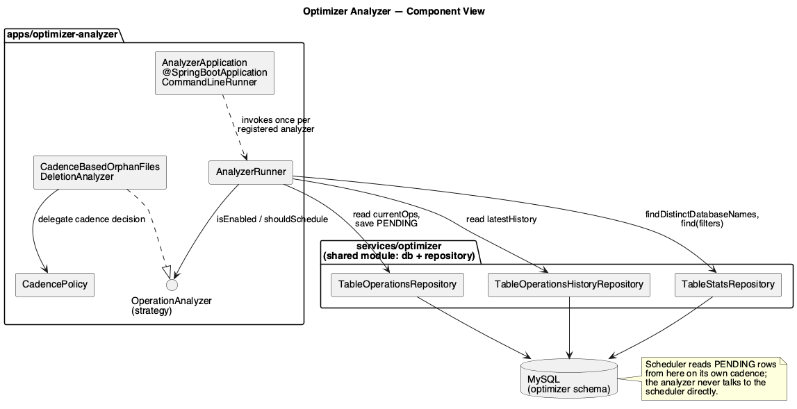
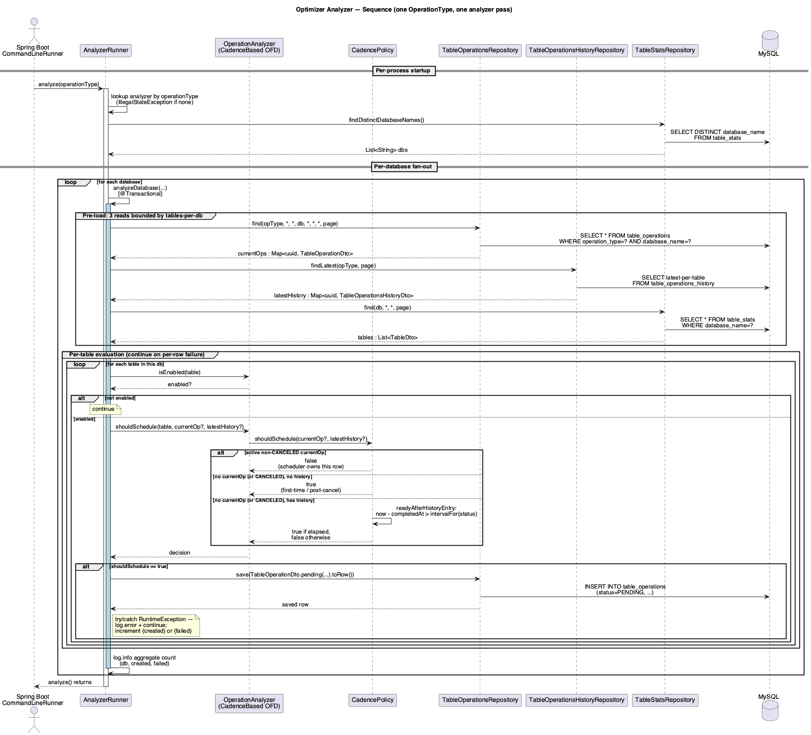

# Optimizer Analyzer — Architecture

The Optimizer Analyzer is a batch process that decides which tables need a maintenance operation scheduled. It is **not** a continuously running service — it is a Spring Boot `CommandLineRunner` invoked per process invocation (typically on a cron). One pass evaluates every table opted in to a given operation type and writes a `PENDING` row to the optimizer DB for each table that needs work. The Scheduler picks those rows up on its own cadence.

This document describes the components, dependencies, and the per-pass call flow.

## Component view

| Component | Role |
|---|---|
| `AnalyzerApplication` | Spring Boot entry point. `@SpringBootApplication` + `CommandLineRunner` that invokes `AnalyzerRunner.analyze(operationType)` once per registered `OperationAnalyzer` per process. |
| `AnalyzerRunner` | The per-pass orchestrator. Resolves the matching analyzer for an operation type, fans out across databases, and per database pre-loads three intermediate maps before evaluating each table. |
| `OperationAnalyzer` (interface) | Strategy interface. Each implementation declares (a) which `OperationType` it handles, (b) `isEnabled(table)` — the per-table opt-in check, and (c) `shouldSchedule(table, currentOp?, latestHistory?)` — the per-table decision. |
| `CadenceBasedOrphanFilesDeletionAnalyzer` | First implementation. Opts in via the `maintenance.optimizer.ofd.enabled` table property. Delegates the cadence decision to `CadencePolicy`. |
| `CadencePolicy` | Time-based scheduling policy. Stays out of any table that already has a non-`CANCELED` active operation; for others, decides re-scheduling eligibility from the most recent completed-history entry using configurable success/failure retry intervals. |
| `TableOperationsRepository`, `TableOperationsHistoryRepository`, `TableStatsRepository` | Defined in `services/optimizer` and shared with the analyzer / scheduler apps via the `apps/optimizer` shared module. The analyzer reads from all three and writes only to `TableOperationsRepository`. |

The analyzer never talks to the Scheduler directly. The contract between them is the `table_operations` table in MySQL — the analyzer inserts `PENDING` rows; the scheduler claims them.

## Sequence view

The sequence below covers **one operation type, one analyzer pass**, fanned out across all databases. The `CommandLineRunner` repeats this loop once per registered `OperationAnalyzer` per process startup.

### Phases

**Per-process startup.** `AnalyzerRunner.analyze(operationType)` resolves the matching analyzer (throws `IllegalStateException` if none is registered for the given type) and calls `statsRepo.findDistinctDatabaseNames()` for the fan-out list. If `analyze(...)` is called with an explicit `databaseName` filter, the fan-out is a singleton list and `findDistinctDatabaseNames` is not called.

**Per-database fan-out.** Each database is processed in its own `@Transactional` `analyzeDatabase(...)` call. The transaction boundary spans the three pre-load reads and the per-table save loop, giving a consistent snapshot of (current operations, latest history, tables) across the iteration. The working set is bounded by tables-per-db rather than tables-total.

**Pre-load: three reads.** Inside the transaction, three queries load the intermediate maps once per database:

1. `operationsRepo.find(opType, *, *, db, *, *, *, page)` → `Map<tableUuid, TableOperationDto>` — current active operations for this op type in this database. The collector uses `TableOperationDto::mostRecent` as the merge function so duplicate rows (which the scheduler dedups separately) resolve to the most recent.
2. `historyRepo.findLatest(opType, page)` → `Map<tableUuid, TableOperationsHistoryDto>` — latest completed-history entry per table. Collector merge uses `TableOperationsHistoryDto::after` (which trusts the service-set `completedAt` invariant).
3. `statsRepo.find(db, *, *, page)` → `List<TableDto>` — the candidate tables in this database.

**Per-table evaluation.** For each table:

1. `analyzer.isEnabled(table)` — skip if the table is not opted in to this operation type.
2. `analyzer.shouldSchedule(table, currentOp?, latestHistory?)` — for the cadence-based analyzer this delegates to `CadencePolicy.shouldSchedule`, which has three branches:
   - **Active non-`CANCELED` `currentOp`:** return `false` — the scheduler owns this row.
   - **No active (or `CANCELED`) `currentOp` + no history:** return `true` — first-time / post-cancel; schedule.
   - **No active (or `CANCELED`) `currentOp` + history present:** return `true` if `now − completedAt > intervalFor(status)` (where `intervalFor` is `successRetryInterval` on `SUCCESS`, `failureRetryInterval` on `FAILED`; a switch with throwing default surfaces any new `HistoryStatusDto` value as a runtime error rather than silently bucketing it).
3. On `true`, save a new `PENDING` row via `operationsRepo.save(...)`. The save is wrapped in `try { ... } catch (RuntimeException) { log.error; continue; }` — a single bad row never aborts the rest of the database's iteration. Per-row outcomes increment `created` or `failed`, logged as a single aggregate `INFO` line per database at the end.

**Per-table logs are at `DEBUG` level.** The per-database aggregate is at `INFO`. This keeps INFO-level output bounded by `databases × operation_types`, not `tables × operation_types`.

## Concurrent-instance contract

Two analyzer instances running concurrently against the same MySQL **may** both insert a `PENDING` row for the same `(tableUuid, operationType)` — there is no uniqueness constraint on `table_operations`, and multiple PENDING/SCHEDULING/SCHEDULED rows for the same table are intentionally allowed. The dedup mechanism is `SchedulerRunner.cancelDuplicates`, which runs per scheduling cycle. The analyzer's own logic does not coordinate with itself or with the scheduler beyond the read snapshot.

## Configuration

| Property | Default | Effect |
|---|---|---|
| `ofd.success-retry-hours` | `16` | Hours to wait after a `SUCCESS` history entry before re-evaluating. Configured below 24h so at least one re-evaluation is guaranteed in any rolling 24-hour window regardless of when the prior run landed. |
| `ofd.failure-retry-hours` | `1` | Hours to wait after a `FAILED` history entry before retrying. Shorter than success so transient failures recover quickly. |
| `optimizer.repo.default-limit` | `10000` | Per-query LIMIT on the three pre-load reads. `Pageable` cascades to `LIMIT n` in SQL. |
| `maintenance.optimizer.ofd.enabled` (table property, not app config) | (absent) | Per-table opt-in for OFD. Must equal the string `"true"` for `isEnabled` to return `true`. |

## Source of truth

- Renderable PlantUML sources: [`diagrams/component.puml`](diagrams/component.puml), [`diagrams/sequence.puml`](diagrams/sequence.puml).
- The diagrams describe the analyzer as implemented in `apps/optimizer-analyzer` (introduced in PR #533).
- Open scale-test work: [BDP-102738](https://linkedin.atlassian.net/browse/BDP-102738).
- Open OTel-metrics work for both analyzer + scheduler: [BDP-102737](https://linkedin.atlassian.net/browse/BDP-102737).
- Open MySQL TX-validation work: [BDP-102739](https://linkedin.atlassian.net/browse/BDP-102739).
