# Openhouse Table Location Update and Rollback

This demo shows how OpenHouse can move an Iceberg table's storage location without downtime or data loss.

Then we demo a zero-downtime rollback using Iceberg branches: the diff is written to the pre_migration branch (files land at the source), then main is atomically replaced with the branch head. No query ever sees partial data.

A table starts on one storage location, gets migrated to a second, and then rolls back to the original — all while preserving every row.

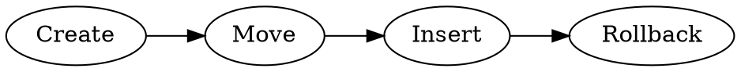

The key operations:
1. **Create** a table and insert data at the original storage location
2. **Migrate** the table to a new storage location (new metadata.json, new data path)
3. **Insert** more data at the new location to prove writes work
4. **Rollback** to the original location — swap storage location back, write the diff to the pre_migration branch, atomically replace main with the branch

This is the foundation for data movement: tables can be relocated across storage systems (HDFS clusters, blob stores) using Iceberg's metadata-level location swap, with branches providing safe rollback points.

## Launch Spark Shell

```bash
docker exec -it local.spark-master /opt/spark/bin/spark-shell \
    --jars /opt/spark/openhouse-spark-runtime_2.12-latest-all.jar \
    --packages org.apache.iceberg:iceberg-spark-runtime-3.5_2.12:1.5.2 \
    --conf spark.sql.extensions=org.apache.iceberg.spark.extensions.IcebergSparkSessionExtensions,com.linkedin.openhouse.spark.extensions.OpenhouseSparkSessionExtensions \
    --conf spark.sql.catalog.openhouse=org.apache.iceberg.spark.SparkCatalog \
    --conf spark.sql.catalog.openhouse.catalog-impl=com.linkedin.openhouse.spark.OpenHouseCatalog \
    --conf spark.sql.catalog.openhouse.uri=http://openhouse-tables:8080 \
    --conf spark.sql.catalog.openhouse.cluster=LocalHadoopCluster \
    --conf "spark.sql.catalog.openhouse.auth-token=$(cat /Users/mkuchenb/code/openhouse/services/common/src/main/resources/dummy.token)"
```

## Spark Shell (Scala)

### Step 1: Create table [locked]

```scala
spark.sql("DROP TABLE IF EXISTS openhouse.demo_db.sl_test")
spark.sql("REFRESH TABLE openhouse.demo_db.sl_test")
```
```scala
spark.sql("CREATE TABLE openhouse.demo_db.sl_test (id INT, step STRING)")
```

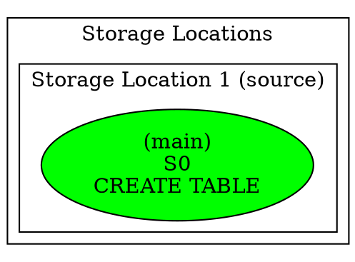

### Step 2: Insert [locked]

```scala
spark.sql("INSERT INTO openhouse.demo_db.sl_test VALUES (1, 'before migration')")
```

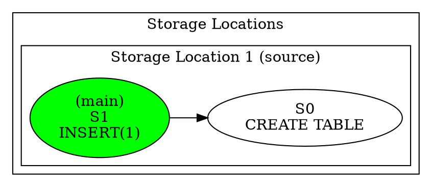

### Step 3: Verify [locked]

```scala
spark.sql("SELECT * FROM openhouse.demo_db.sl_test").show(false)
```

### Step 4: Create branch [locked]

```scala
spark.sql("ALTER TABLE openhouse.demo_db.sl_test CREATE BRANCH pre_migration")
```

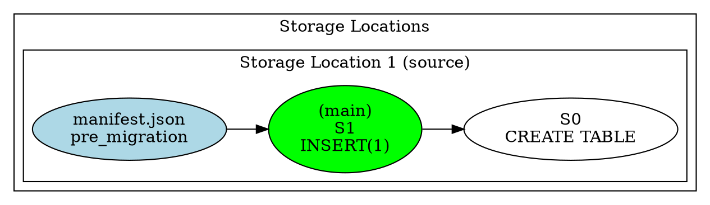

### Step 5: Migrate [locked]

Today this is an endpoint on the Openhouse tables service, but it can be made an SQL command to update storage location. This way you would be able to select a set of tables that have storage locations particular type of storage, and update the storage location using pure sql.

e.g.
```sql
SELECT * FROM
  Tables Join StorageLocations
WHERE StorageLocations.PhysicalStorageLocation = 'Holdem11'
AND ...
LIMIT <batchsize>
```

For each of those tables, move to destination storage:
```sql
ALTER TABLE <table> UPDATE STORAGE LOCATION (PhysicalStorageLocation = 'Holdem120')
```
or
```sql
ALTER TABLE <table> UPDATE STORAGE LOCATION (PhysicalStorageLocation = 'BlobStorage')
```


The script does the following:
1. Allocates a new storage location at the destination the destination.
2. Updates the table's storage location to the newly allocated storage.

```bash
./alter_table_update_storagelocation.sh demo_db.sl_test
```

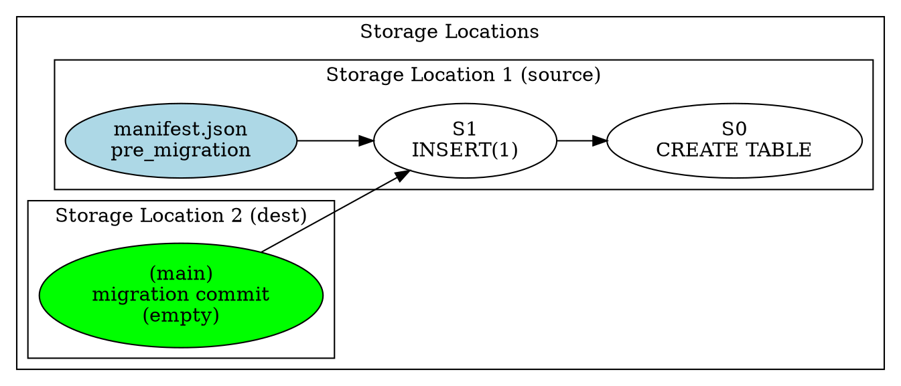

### Step 6: Verify after migration [locked]

```scala
spark.sql("SELECT * FROM openhouse.demo_db.sl_test").show(false)
```

### Step 7: Insert after migration + verify [locked]

```scala
spark.sql("INSERT INTO openhouse.demo_db.sl_test VALUES (2, 'after migration')")
spark.sql("SELECT * FROM openhouse.demo_db.sl_test").show(false)
```

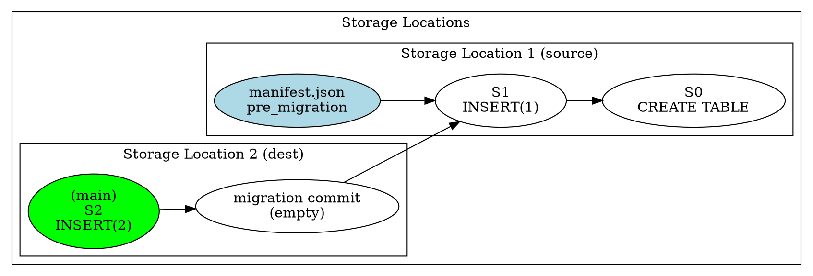

### Step 8: Branch pre-rollback

```scala
spark.sql("ALTER TABLE openhouse.demo_db.sl_test CREATE BRANCH pre_rollback")
```

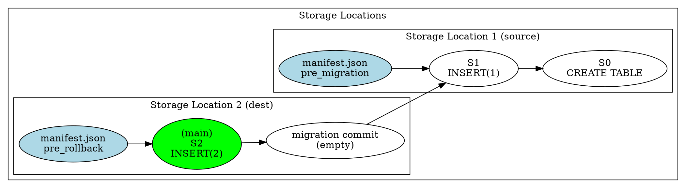

### Step 9: Rollback

**9a.** Update Storage location back to the original. [locked]
```bash
TOKEN=$(cat /Users/mkuchenb/code/openhouse/services/common/src/main/resources/dummy.token)

TABLE_JSON=$(curl -s -H "Authorization: Bearer $TOKEN" \
  http://localhost:8000/v1/databases/demo_db/tables/sl_test)
ACTIVE_URI=$(echo "$TABLE_JSON" | jq -r '.tableLocation | split("/") | .[0:-1] | join("/")')
ORIG_SL_ID=$(echo "$TABLE_JSON" | jq -r --arg active "$ACTIVE_URI" \
  '.storageLocations[] | select(.uri != $active) | .storageLocationId')
echo "Restoring to: $ORIG_SL_ID"

curl -s -X PATCH http://localhost:8000/v1/databases/demo_db/tables/sl_test/storageLocation \
  -H 'Content-Type: application/json' \
  -H "Authorization: Bearer $TOKEN" \
  -d "{\"storageLocationId\":\"$ORIG_SL_ID\"}"
```

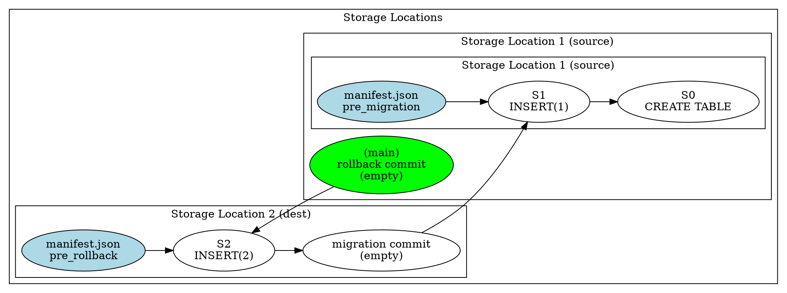

**9b.** Write the diff (data inserted at the destination after migration) to the `pre_migration` branch. The table location is now SL1 (from 9a), so new data files land at SL1. Uses the Iceberg `branch_` table identifier to write directly to the branch — no WAP configuration needed.
```scala
spark.sql("REFRESH TABLE openhouse.demo_db.sl_test")

// main has all rows (1+2), pre_migration has only pre-migration rows (1)
val currentData = spark.table("openhouse.demo_db.sl_test")
val baseData = spark.table("openhouse.demo_db.sl_test.branch_pre_migration")
val diff = currentData.except(baseData)

// Write diff directly to pre_migration branch — files land at SL1
diff.writeTo("openhouse.demo_db.sl_test.branch_pre_migration").append()
```

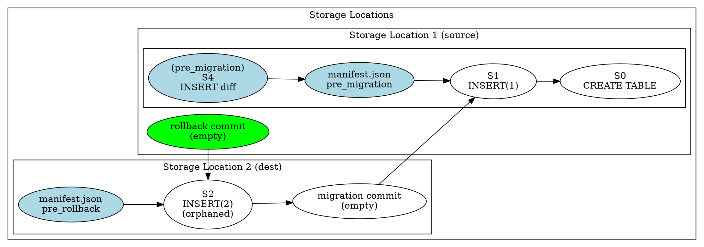

**9c.** Atomically replace main with the pre_migration branch head. This is the same pattern used by LinkedIn's KCP rebootstrap workflows (`ManageSnapshots.replaceBranch`). Main now points to S4 which has all data at SL1.
```scala
import org.apache.iceberg.spark.Spark3Util
val icebergTable = Spark3Util.loadIcebergTable(spark, "openhouse.demo_db.sl_test")
val branchSnap = icebergTable.snapshot("pre_migration").snapshotId()
icebergTable.manageSnapshots().replaceBranch("main", branchSnap).commit()
```

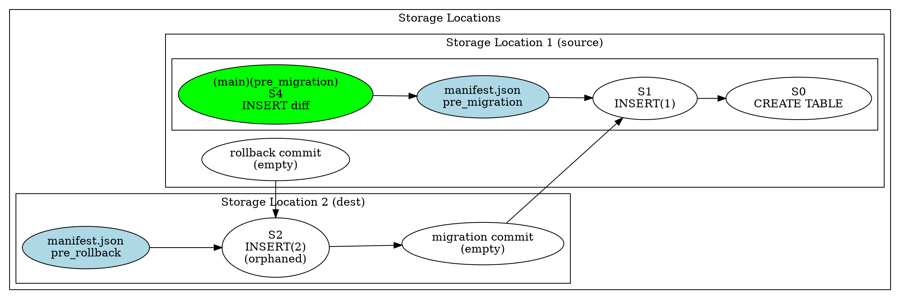

### Step 10: Verify (both rows)

```scala
spark.sql("SELECT * FROM openhouse.demo_db.sl_test").show(false)
```

### Step 11: Clean up destination data files

All data is now at SL1. The destination only contains orphaned data files from the migration. Safe to delete the data directory while preserving the storage location itself.

```bash
TOKEN=$(cat /Users/mkuchenb/code/openhouse/services/common/src/main/resources/dummy.token)

# Get the destination (non-active) SL URI
TABLE_JSON=$(curl -s -H "Authorization: Bearer $TOKEN" \
  http://localhost:8000/v1/databases/demo_db/tables/sl_test)
ACTIVE_URI=$(echo "$TABLE_JSON" | jq -r '.tableLocation | split("/") | .[0:-1] | join("/")')
DEST_URI=$(echo "$TABLE_JSON" | jq -r --arg active "$ACTIVE_URI" \
  '.storageLocations[] | select(.uri != $active) | .uri')
echo "Deleting data files at: $DEST_URI"
docker exec local.spark-master hdfs dfs -rm -r -skipTrash "$DEST_URI"
```

### Step 12: Verify after cleanup

```scala
spark.sql("SELECT * FROM openhouse.demo_db.sl_test").show(false)
```

### Step 13: Insert after rollback + verify

```scala
spark.sql("INSERT INTO openhouse.demo_db.sl_test VALUES (3, 'after rollback')")
spark.sql("SELECT * FROM openhouse.demo_db.sl_test").show(false)
```

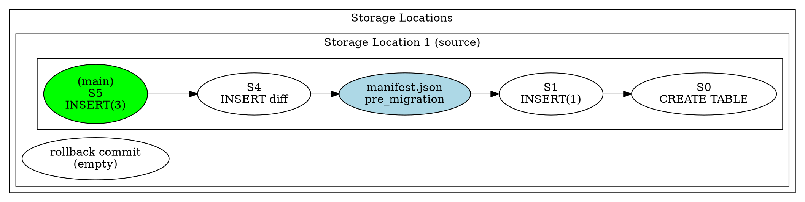

### Step 14: Validate you can still read [locked]

```scala
spark.sql("SELECT * FROM openhouse.demo_db.sl_test").show(false)
```
