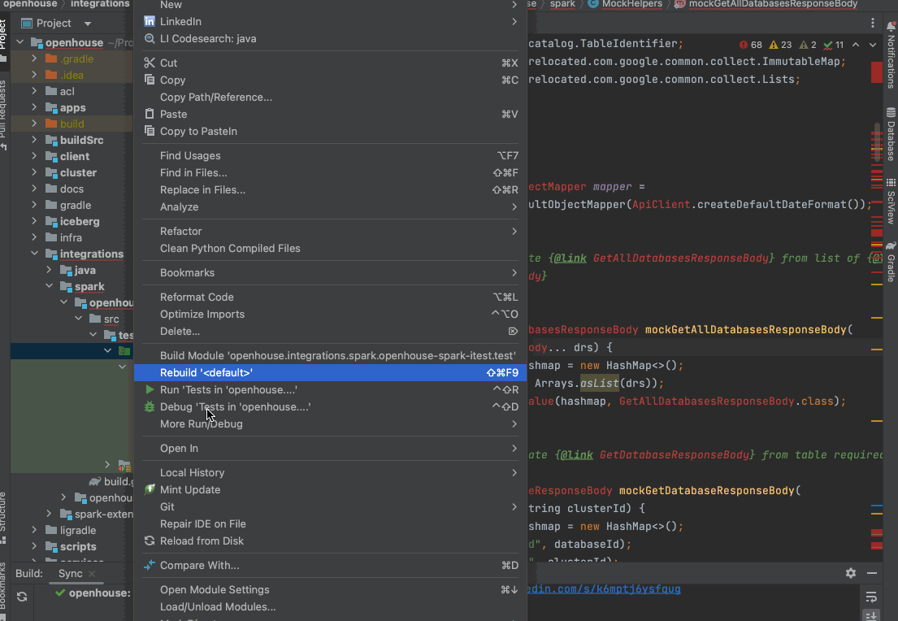

# Build OpenHouse
## Prerequisite
- Java 1.8 or above
- Scala 2.12 or above

## Steps 
Simply run `./gradlew clean build`.

# Using IDE
## IntelliJ
There are a few subprojects, like `:client:tableclient` that contains no code before build and include generated
source as part of source files during build runtime. There are also classes imports generated source as libraries.
To ensure they are properly indexed by IDE, you need to:
- Run a full build after fresh repository checkout.
- Open the OpenHouse project from the root `build.gradle` file in the repo.

### Fixing missing classes errors
Intellij doesn't work nicely with shadow plugin, this is a known issue tracked here: [IntelliJ IDEA unable to resolve classes of project dependency shadow jar #264](https://github.com/johnrengelman/shadow/issues/264)

Modules such as `:integrations:spark:spark-3.1:openhouse-spark-itest` `:integrations:java:iceberg-1.2:openhouse-java-itest` face this issue.

To fix this issue please follow instructions as follows: [define-library](https://www.jetbrains.com/help/idea/library.html#define-library)
