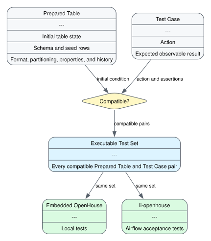

# How integration tests are generated

[TEST-COVERAGE.md](TEST-COVERAGE.md) lists the prepared tables, test cases, and
expected behavior. The test generator pairs each test case with every compatible
prepared table. Each prepared table includes its storage format.



The [Graphviz source](COVERAGE-MODEL.dot) is kept beside the rendered diagram.

## Prepared tables

A prepared table is an initial condition for a test case. Schema and seed rows
are standardized where possible. Storage format, partitioning, write ordering,
properties, policies, snapshots, lineage, delete files, and references can vary.

A prepared table can establish the same rows and schema through create and
populate, Replace Table As Select, or drop and restore. Running the same test
cases against those tables reveals whether lineage changes observable behavior.

## Test cases

A test case defines an operation and its expected observable result. One
definition supplies the action and assertions for every compatible prepared
table.

## Compatibility and the generated set

The test generator considers the matrix product of prepared tables and test
cases:

```text
Executable Test Set = compatible(Prepared Tables x Test Cases)
```

Compatibility selects the pairs that enter the executable test set. Unsupported
feature combinations remain empty cells, which makes the matrix jagged.

Adding a prepared table applies every compatible existing test case to a new
initial condition. Adding a test case applies it to every compatible existing
prepared table. Adding a storage format adds prepared tables in that format, so
the new combinations reuse the existing test-case definitions.

## Run the generated set

Both environments run the same executable test set:

- Embedded OpenHouse provides local testing.
- li-openhouse runs Airflow acceptance tests against real clusters.
