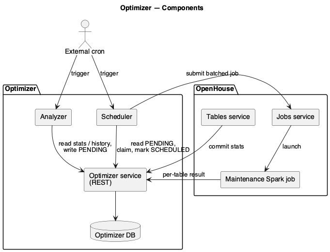
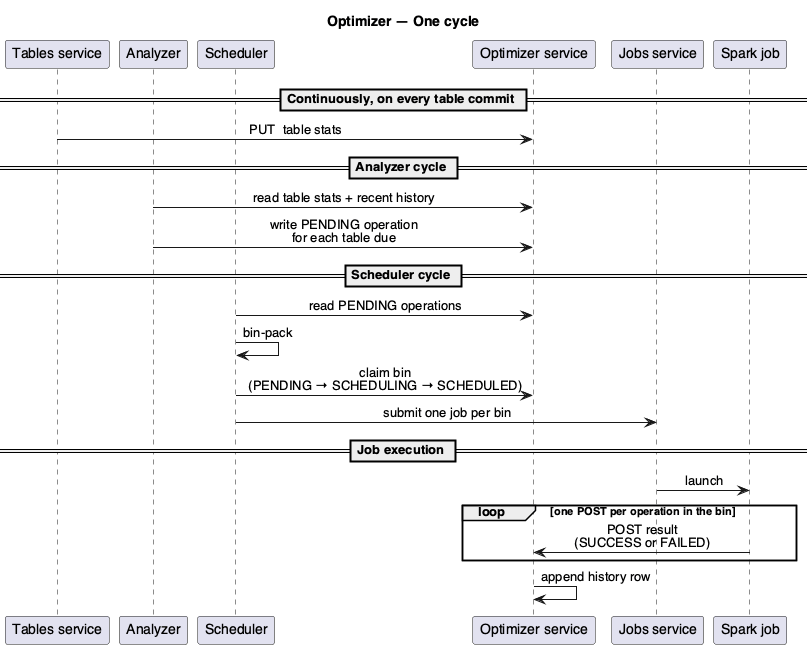
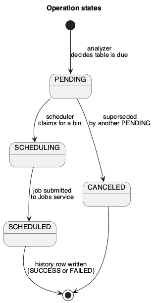

# Optimizer architecture

The Optimizer is a continuous maintenance loop for OpenHouse Iceberg tables. It decides which tables need work, batches that work into one Spark job per bin, and records the outcome. It replaces the previous fixed-cron, one-job-per-`(table, operation)` model.

## Components



| Component | Role | Shape |
|---|---|---|
| **Analyzer** | Decides which tables are due for an operation; writes a `PENDING` row per table. | Short-lived job (cron). |
| **Scheduler** | Reads `PENDING` rows, bin-packs them, claims a bin, submits one Spark job. | Short-lived job (cron). |
| **Optimizer service** | REST API and the persistence layer for all operation state. | Long-running service. |
| **Optimizer DB** | Stores operations, history, table stats, and stats history. | MySQL. |

The Optimizer interacts with three OpenHouse components at its boundary:

- **Tables service** — pushes per-commit table stats into the Optimizer service.
- **Jobs service** — accepts job submissions from the Scheduler and launches Spark.
- **Maintenance Spark job** — runs the work for a bin and reports per-table results back to the Optimizer service.

## One cycle, end to end



Five things happen, in order:

1. **Tables service** writes the latest table stats to the Optimizer service on every Iceberg commit. This is the freshness signal the Analyzer uses to decide what's due.
2. **Analyzer** reads stats and recent history, then writes one `PENDING` operation per table that should be processed this cycle.
3. **Scheduler** reads `PENDING` operations, bin-packs them, and claims a bin by walking each operation through `PENDING → SCHEDULING → SCHEDULED`.
4. **Scheduler** submits one Spark job per bin to the Jobs service.
5. **Spark job** runs and POSTs per-operation results back to the Optimizer service, which appends a history row for each.

The Analyzer and Scheduler do not talk to each other. The contract between them is the operations table — the Analyzer writes `PENDING`, the Scheduler consumes `PENDING`. Anything more sophisticated (cadence, retry, bin sizing) is internal to one side or the other.

## Operation states



A given `(table, operation type)` may have multiple operations in flight by design; the Scheduler reconciles duplicates per cycle by cancelling all but the oldest. Once an operation transitions to `SCHEDULED`, its outcome is captured as a history row rather than another state change on the operation itself.

## REST endpoints (Optimizer service)

| Endpoint | Purpose |
|---|---|
| `POST /v1/optimizer/operations/{id}/update` | Reports the outcome of one operation (called by the Spark job). |
| `GET  /v1/optimizer/operations/{id}` | Fetches a single operation by id. |
| `GET  /v1/optimizer/operations` | Lists operations with optional filters. |
| `GET  /v1/optimizer/operations-history/{tableUuid}` | Recent history for a table. |
| `PUT  /v1/optimizer/stats/{tableUuid}` | Upserts table stats (called by the Tables service on commit). |
| `GET  /v1/optimizer/stats/{tableUuid}` | Fetches current stats for a table. |
| `GET  /v1/optimizer/stats` | Lists stats with optional filters. |
| `GET  /v1/optimizer/stats/{tableUuid}/history` | Per-commit stats history for a table. |

Payload shapes and parameter details are in the OpenAPI spec generated from the controllers.

## Enabling optimization on a table

A table opts into a given operation type via a table property of the form `maintenance.optimizer.<op>.enabled=true`. The Analyzer ignores any table without the relevant flag.

Example — enable orphan-file deletion:

```sql
ALTER TABLE db.tbl
  SET TBLPROPERTIES ('maintenance.optimizer.ofd.enabled'='true');
```

## Adding a new operation type

Four steps:

1. **Declare the type.** Add the new value to the `OperationType` enum and any wire/model variants, with the corresponding conversion methods.
2. **Implement an analyzer strategy.** Provide an `OperationAnalyzer` implementation that decides when a table is due. Register it as a Spring component; the Analyzer process picks it up via the registered list.
3. **Implement a bin packer.** Provide a `BinPacker` keyed by the new `OperationType`. The Scheduler process picks it up via the registered map.
4. **Wire up configuration.** Tuning knobs go under `<op>.*` (analyzer) and `scheduler.<op>.*` (scheduler) keys; the table-level opt-in flag is `maintenance.optimizer.<op>.enabled`.

The Optimizer service itself does not change when a new operation type is added — it is operation-type agnostic.

## Diagrams

Sources are in [`diagrams/`](diagrams/) as PlantUML (`.puml`) plus the rendered PNGs that GitHub displays above. To regenerate after editing a source:

```sh
cd diagrams
./render.sh
```

Requirements and full instructions are at the top of [`diagrams/render.sh`](diagrams/render.sh).
